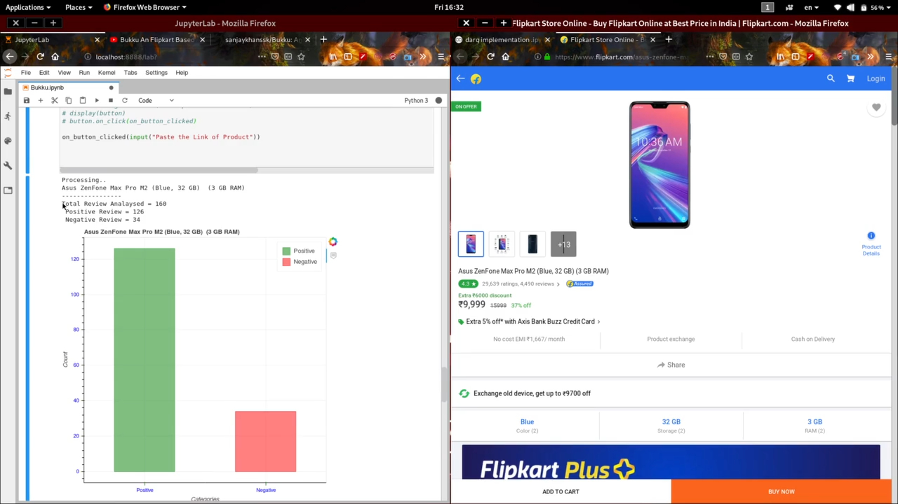
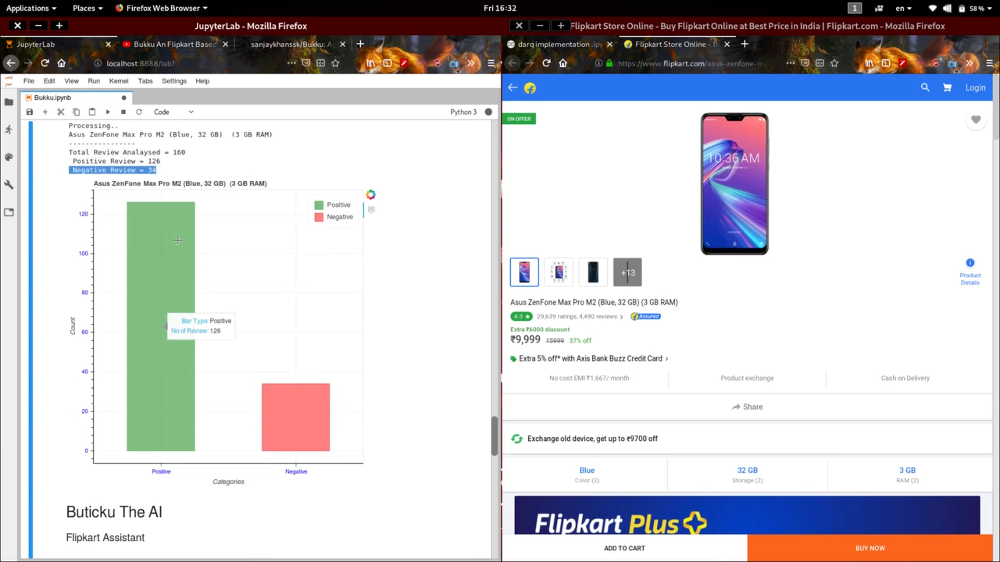
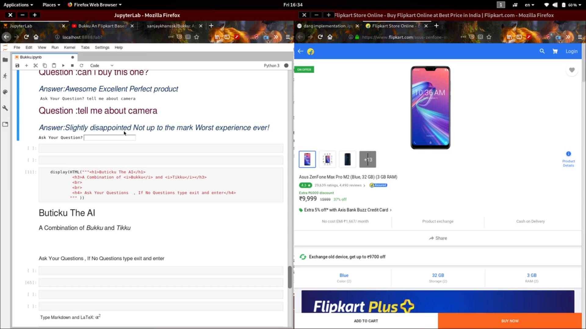
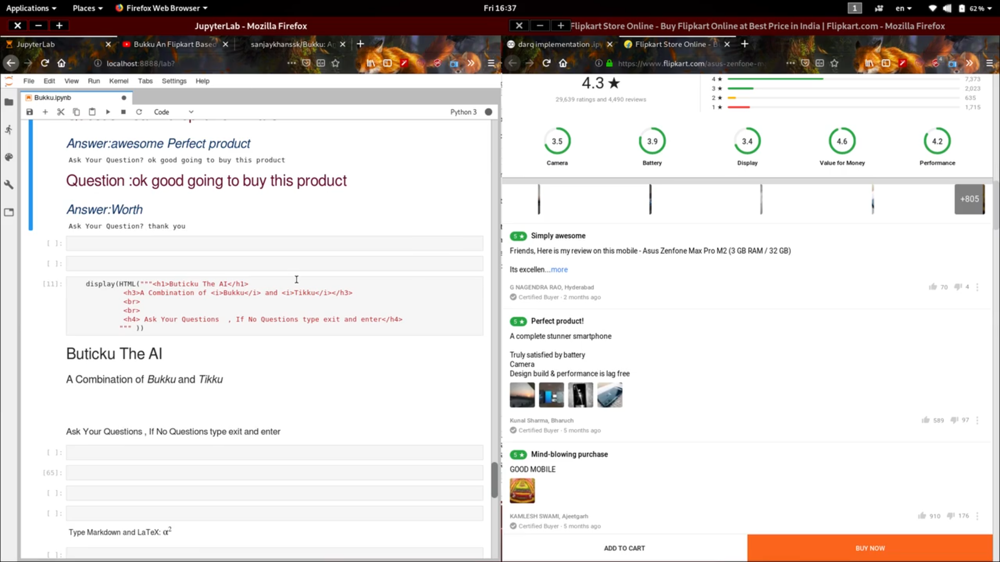

# Buticku 
It is a Combination of my old project [Bukku](https://github.com/sanjaykhanssk/bukku) & Tikku.

## Screenshots
>This image shows the Analysed count as [Positive and Negative]

>This Image shows the Intractive Bar Chart , to the user to easy understand what is going on the commands

> This image shows that the user is asking the question to the AI  , and it's Responding for the user question

[]

> [Youtube Video](youtube.com/c/historyofbits)

> [Bukku](https://github.com/sanjaykhanssk/bukku) is a AI flipkart assistant  

> Tikku is implemented in [facebook's DRQA Project](https://github.com/hitvoice/drqa)

# The Goal of this mini Projects:

> # 1.Bukku
 <dl>
 

<h3 >
The Goal of <i> <b>Bukku</b></i> is to scarpe and analsye  all the commands from *Flipkart* products page and
label it is positive or negative and viziulize in a bar plot
</h3>

> # 2.Tikku
 

<h3 >
The Goal of <i> <b>Tikku</b></i> is <i>Question Answering Bot from given passage / content  </i> inspired from <a href="https://demo.allennlp.org/reading-comprehension">Allen NLP QA System</a>
</h3>

</dl>

<dl>

<h2>
I already said that Buticku is combination of [Bukku](https://github.com/sanjaykhanssk/bukku) and Tikku .</h2>

But Tikku needs a GPU to use it as fast  , it's ver slow in CPU , so i trained the Tikku in Google Colab .

<h1 style="color:">  Firebase Cloud Database</h1>
With the help of Firebase Cloud DataBase these two AI's are interacting with each other 
 

</dl>
